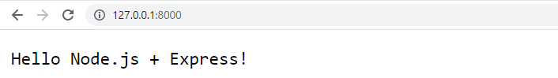

# Hello Node.js + Express

Again, we are going to create the famous "Hello World" using Node.js and a server running inside our computer (*localhost*), but using *Express* module so... Let`s do it!

First import the module and set the variables:

```jsx
const express = require("express");// imports express module
const app = express()
const port = 8000 //define the port we will use
```

Once we already specified de protocol (*http*), module and the port (*8000*), let`s initialize the server, set a response and write a message when the server is running.

```jsx
// app.get('/test', (req, res) => { //will use 127.0.0.1/8000/test

app.get('/', (req, res) => { //will use 127.0.0.1/8000
    res.end("Hello Node.js + Express!")
});

app.listen(port, () => {
    console.log(`Server is running and is using Express module! (port ${port})`)
});
```

Now we can start our local server with Node and access it inside our internet browser. First starting the application:

```bash
node hellonodeExpress.js
```

The terminal output should be something like this:

```bash
"Server is running and is using Express module! (port 8000)"
```

The web browser answer should be this:



To close your application you should open the Node server terminal and press *Ctrl + C*.

[](https://github.com/lucarampi/Node.js-Learning/tree/master/2%20-%20SC%20Hello%20Node%20(with%20Express))